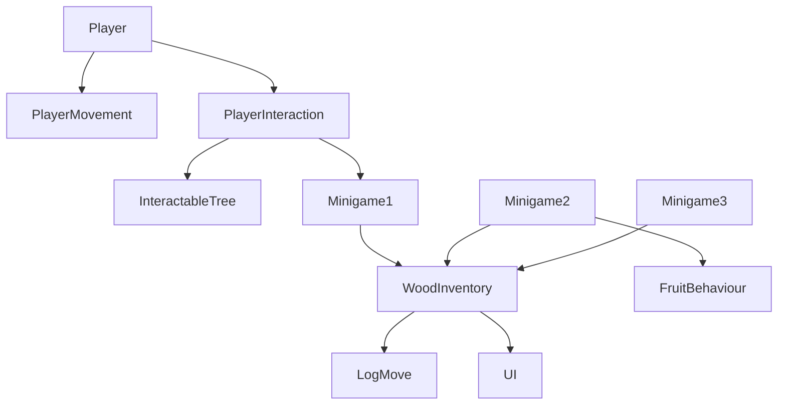

# Project Documentation – Wood & Minigames

This project is built around a simple loop:

**Player interacts → minigame → resources updated → UI feedback**

Everything revolves around keeping responsibilities separated so changes in one system don't break others.

## Player & Interaction

### PlayerMovement

Handles basic player movement.

- Uses a Rigidbody and force-based movement
- Supports multiple players using playerID
- Input keys are assigned per player
- Movement is normalized to prevent diagonal speed boosts

**This script only moves the player.**
It doesn't know anything about minigames, trees, or inventory.

### PlayerInteraction

Handles interaction with objects in the world.

- Detects interactables using trigger colliders
- Starts Minigame1 when the interact key is pressed
- Injects required data into the minigame:
  - Player reference
  - WoodInventory reference
  - Tree type (for rewards)

This script exists so:

- Players don't directly control minigames
- Minigames don't need to search the scene for data

### InteractableTree

Represents a tree that can be chopped.

- Stores the tree type (Oak / Birch / Pine)
- Implements IInteractable
- Does not start minigames or give rewards directly

The tree is just data + an interaction point.
All logic is handled elsewhere.

## Inventory & UI

### WoodInventory

Central resource manager.

**Stores:**
- Logs
- Planks
- Tool tier

**Handles:**
- Adding resources
- Converting logs → planks
- Updating UI text
- Triggering UI animations

**Important rule:**

No other script should directly change wood values.
Minigames request changes, WoodInventory decides if it's allowed.

### LogMove

UI animation helper.

- Animates logs or planks flying into the inventory UI
- Spawned by WoodInventory
- Uses RectTransform only (UI space)
- Destroys itself when finished

This keeps animation logic out of gameplay scripts.

## Minigames

### Minigame1 – Chopping Timing Game

A timing-based chopping minigame.

- A moving indicator goes up and down
- Player presses a key to chop
- Hit zone shrinks over time

**Results:**
- Miss → nothing
- Normal hit → logs
- Perfect hit → planks

**Important details:**
- Receives all references via injection
- Never directly modifies inventory values
- Uses UnityEvent for feedback and effects
- Ends automatically on timer or score goal

### Minigame2 – Plank Crafting (Falling Fruit)

Lane-based crafting minigame.

- Fruit falls down lanes
- Player moves side to side to catch them
- Catching consumes logs and crafts planks

**Key logic:**
- Uses FruitBehaviour for fruit lifecycle
- Inventory is checked before crafting
- Fails silently if resources are missing
- Ends when enough planks are crafted

This minigame enforces resource cost strictly.

### FruitBehaviour

Lightweight helper for Minigame2.

**Tracks:**
- Lane index
- Lifetime
- Whether it's collected
- Handles self-destruction

No inventory or scoring logic.
It exists to keep Minigame2 clean.

### Minigame3 – Nail & Hammer Co-op Game

Cooperative reflex minigame.

- Player 1 places nails
- Player 2 hammers them
- Time decreases every round

**Features:**
- Fully UI-based
- Uses coroutines for animations
- Manages its own camera switching
- Handles failure cleanly by resetting state

This script is self-contained and doesn't depend on other minigames.

## How Everything Connects (Mermaid Diagram)

## Class Diagram

```mermaid
classDiagram
    %% Interfaces / Enums
    class IInteractable {
      <<interface>>
      +Interact(player: GameObject)
    }

    class TreeType {
      <<enumeration>>
      Oak
      Birch
      Pine
    }

    %% InteractableTree
    class InteractableTree {
      -treeType: TreeType
      -woodInventory: WoodInventory
      +TreeTypeName: string
      +Start()
      +Interact(player: GameObject)
    }
    InteractableTree ..|> IInteractable

    %% FruitBehaviour
    class FruitBehaviour {
      -lifeTime: float
      -timer: float
      +LaneIndex: int
      +Collected: bool
      +Init(lifeSeconds: float, lane: int)
      +Update()
      +MarkCollected()
    }

    %% PlayerInteraction
    class PlayerInteraction {
      -playerMovement: PlayerMovement
      -playerInRange: bool
      -interactable: IInteractable
      -interactKey: KeyCode
      -minigame1: GameObject
      -woodInventory: WoodInventory
      +Awake()
      +Update()
      +OnTriggerEnter(other: Collider)
      +OnTriggerExit(other: Collider)
    }
    PlayerInteraction --> IInteractable : detects
    PlayerInteraction --> Minigame1 : starts
    PlayerInteraction --> WoodInventory : injects

    %% LogMove
    class LogMove {
      -moveDuration: float
      -uiTagName: string
      -endPointOverride: RectTransform
      -rectTransform: RectTransform
      -endPoint: RectTransform
      -startPosition: int
      +Awake()
      +StartMove(start: Vector2)
      +Interact(playerID: int)
      +MoveToCorner(target: Vector2) : IEnumerator
    }

    %% WoodInventory
    class WoodInventory {
      -oak: int
      -birch: int
      -pine: int
      -oakPlanks: int
      -birchPlanks: int
      -pinePlanks: int
      -axeTier: int
      -oakUI: TextMeshProUGUI
      -birchUI: TextMeshProUGUI
      -pineUI: TextMeshProUGUI
      -oakPlanksUI: TextMeshProUGUI
      -birchPlanksUI: TextMeshProUGUI
      -pinePlanksUI: TextMeshProUGUI
      -oakLog: LogMove
      -birchLog: LogMove
      -pineLog: LogMove
      -oakPlank: LogMove
      -birchPlank: LogMove
      -pinePlank: LogMove
      -canvas: Canvas
      -activeLogMove: LogMove
      +Oak: int
      +Birch: int
      +Pine: int
      +OakPlanks: int
      +BirchPlanks: int
      +PinePlanks: int
      +AxeTier: int
      +Update()
      +AddWood(type: string, player: GameObject)
      -InstantiateIfAssigned(prefab: LogMove) : LogMove
      -GetPlayerUIPosition(player: GameObject) : Vector2
      -UpdateUI()
    }

    %% PlayerMovement
    class PlayerMovement {
      -rb: Rigidbody
      -anim: Animator
      -upButton: KeyCode
      -downButton: KeyCode
      -rightButton: KeyCode
      -leftButton: KeyCode
      -playerID: int
      -speed: float
      +PlayerID: int
      +Speed: float
      +Awake()
      +FixedUpdate()
      -Movement()
    }
    PlayerMovement --> WoodInventory : used by (UI spawn pos)

    %% Minigame1
    class Minigame1 {
      -gameDuration: float
      -timer: float
      -movingPiece: RectTransform
      -moveSpeed: float
      -moveRange: float
      -startY: float
      -direction: int
      -hitArea: RectTransform
      -hitAreaShrinkAmount: float
      -minimumHitAreaHeight: float
      -perfectThresholdHeight: float
      -normalReward: int
      -perfectReward: int
      -scoreGoal: int
      -_woodInventory: WoodInventory
      -_playerRef: GameObject
      -_normalHitWoodType: string
      -_perfectHitWoodType: string
      +WoodInventory: WoodInventory
      +PlayerRef: GameObject
      +NormalHitWoodType: string
      +PerfectHitWoodType: string
      -score: int
      -chopKey: KeyCode
      -startPiecePosition: Vector2
      -startHitAreaSize: Vector2
      -onPerfect: UnityEvent
      -onHit: UnityEvent
      -onMiss: UnityEvent
      -onEnd: UnityEvent
      +OnEnable()
      +Update()
      -RunTimer()
      -MovePiece()
      -CheckHit()
      -IsInsideHitArea() : bool
      -ShrinkHitArea()
      -ResetGame()
      -EndMinigame()
      +OnDisable()
      +PerfectHit()
      +Hit()
      +Miss()
    }
    Minigame1 --> WoodInventory : rewards
    Minigame1 ..> LogMove : may instantiate animations

    %% Minigame2
    class Minigame2 {
      -laneCount: int
      -gear: RectTransform
      -playerObject: GameObject
      -startLane: int
      -fruitPrefab: RectTransform
      -fruitParent: RectTransform
      -woodInventory: WoodInventory
      -plankType: string
      -logsRequired: int
      -fallSpeed: float
      -spawnInterval: float
      -targetPlanks: int
      -onWin: UnityEvent
      -playAreaRect: RectTransform
      -currentLane: int
      -craftedPlanks: int
      -spawnTimer: float
      -lastSpawnLane: int
      +OnEnable()
      +Update()
      -HandleInput()
      -MoveLane(dir: int)
      -UpdateGearPosition()
      -HandleSpawning()
      -SpawnFruit()
      -MoveAndCheckFruits()
      -TryCraftPlank(fb: FruitBehaviour)
      -HasRequiredLogs() : bool
      -ConsumeLogs()
      -ModifyRawLogs(type: string, delta: int)
      -IsOverlapping(a: RectTransform, b: RectTransform) : bool
      -GetWorldRect(rt: RectTransform) : Rect
      -GetLaneX(lane: int) : float
    }
    Minigame2 --> FruitBehaviour : spawns/uses
    Minigame2 --> WoodInventory : consumes/creates planks

    %% Minigame3
    class Minigame3 {
      -camPlayer1: Camera
      -camPlayer2: Camera
      -camMinigame: Camera
      -plankParent: RectTransform
      -plankPrefab: RectTransform
      -plankSlideDuration: float
      -nailPrefab: GameObject
      -hammerPrefab: GameObject
      -nailPlaceDuration: float
      -hammerSwingDuration: float
      -hammerReturnDuration: float
      -hammerHitRotation: float
      -nailSinkAmount: float
      -nailSpawnOffset: Vector2
      -hammerStartOffset: Vector2
      -hammerHitOffset: Vector2
      -useCustomNailPoints: bool
      -nailPoint1Position: Vector2
      -nailPoint2Position: Vector2
      -startTime: float
      -timeDecreasePerRound: float
      -placeKeyP1: string
      -hammerKeyP2: string
      -nailsPlaced: int
      -nailsHammered: int
      -round: int
      -minigameActive: bool
      -canPlace: bool
      -canHammer: bool
      -currentPlank: RectTransform
      -plankReady: bool
      -spawnedNails: List~RectTransform~
      -nailIsHammered: List~bool~
      -currentTime: float
      +Start()
      +Update()
      +StartMinigame()
      -StartNextRound()
      -SpawnAndSlidePlank() : IEnumerator
      -HandleInput()
      -PlaceNail()
      -EnableHammerAfterDelay(delay: float) : IEnumerator
      -PlaceNailCoroutine(nailIndex: int) : IEnumerator
      -HammerNail()
      -HammerCoroutine(nailIndex: int) : IEnumerator
      -HandleTimer()
      -FailMinigame()
      -CleanupNails()
      -TryGetNailAnchorPosition(pointNumber: int, out anchoredPos: Vector2) : bool
    }
    Minigame3 --> LogMove : may spawn UI elements
    Minigame3 --> Camera : switches cams
    Minigame3 --> RectTransform : uses plank UI

    %% Associations overview
    PlayerInteraction --> InteractableTree : interacts_with
    InteractableTree --> WoodInventory : uses (AddWood)
    FruitBehaviour --> Minigame2 : used_by
    LogMove --> Canvas : parented_under
    WoodInventory --> LogMove : instantiates
    PlayerMovement ..> PlayerInteraction : attached_to
```

## Design Rules Used in This Project

- No script does more than one job
- Minigames never modify inventory directly
- UI animation is never mixed with gameplay logic
- Public fields are avoided unless required
- Inspector exposure is done via [SerializeField]
